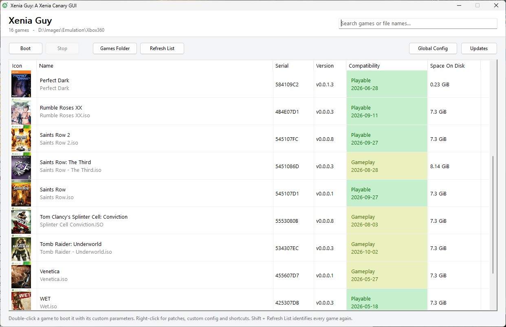
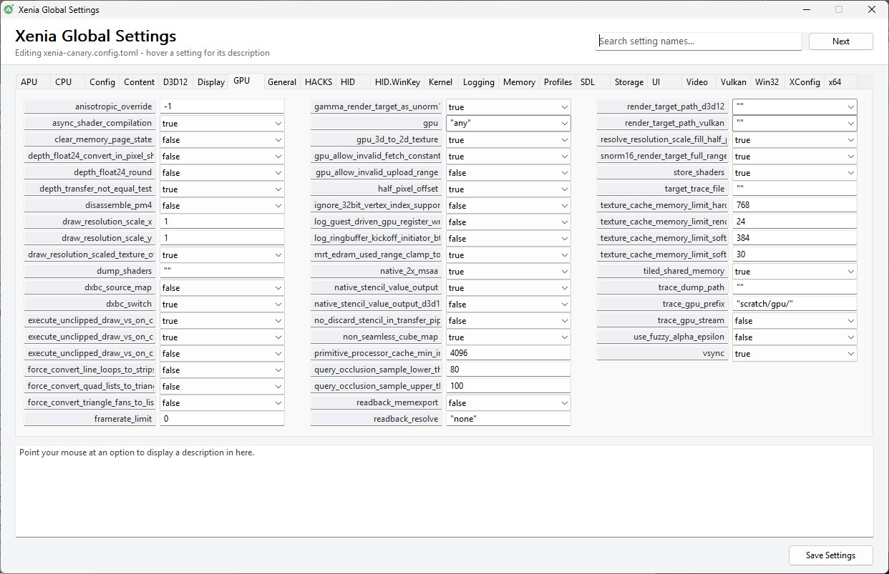
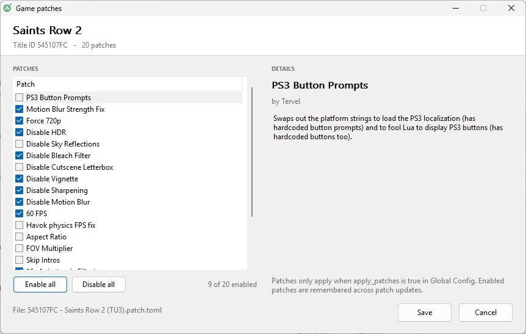

# Xenia Guy

A simple GUI manager for Xenia Canary, in Autoit. Looks and behaves like RPCS3.

## Features

- Scans games, shows posters, names, serials, versions, compatibility ratings, and disk space.
- Boot with custom or global config. Right-click for patches, custom config, and desktop shortcuts.
- Manage game patches (enable/disable, save choices).
- Edit global Xenia settings (xenia-canary.config.toml) with search and descriptions.
- Update compatibility database, patches, and Xenia Canary.
- Made to be as future proof as possible.

## Screenshots

Main window:

Global settings:

Game patches:

## Requirements

- xenia_canary.exe in the same folder. (Xenia Guy can automatically download it via updates)
- Compiled release (.exe) runs without AutoIt.
- To build from source: AutoIt 3.3.18.0 or later from https://www.autoitscript.com/site/autoit/downloads/

